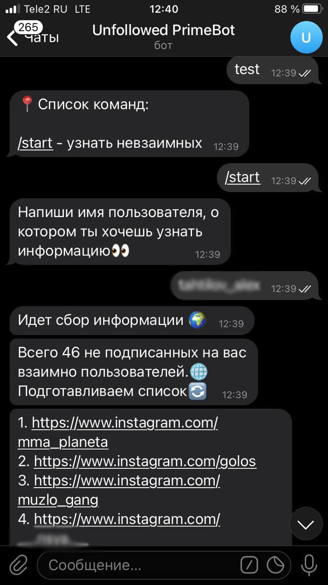

# Телеграм бот
Телеграм бот, с помощью которого можно получиться список пользователей, которые не подписаны в инстаграме взаимно.<br>

## Демонстрация


## Установка
Получаем исходный код проекта:
```
$ git clone git@github.com:SladBlack/telegram-bot.git
```
  
Устанавливаем:
```
$ pip install pytelegrambotapi
$ pip install instabot
$ pip install loguru
```

Команда для запуска бота:<br>
```
$ python bot.py
```
Сам бот находится под ником `@unfollowed_primebot`
